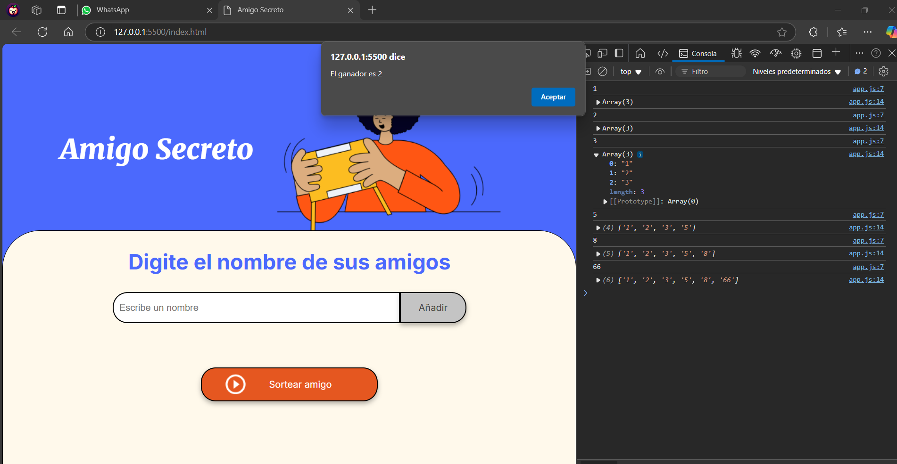

# Amigo Secreto

Este es un proyecto web que te permite realizar un sorteo de "Amigo Secreto" entre un grupo de amigos. El principal objetivo de este desafío es fortalecer tus habilidades en lógica de programación.

## Descripción

La aplicación permite a los usuarios agregar nombres de amigos a una lista y luego realizar un sorteo para elegir un "Amigo Secreto" de forma aleatoria. La lógica de la aplicación está desarrollada en JavaScript.

## Estructura del Proyecto

### Archivos

- `index.html`: Contiene la estructura HTML de la aplicación.
- `style.css`: Incluye los estilos CSS para la presentación de la aplicación.
- `app.js`: Contiene la lógica de la aplicación desarrollada en JavaScript.

## Funcionalidades

- **Agregar Amigos**: Permite a los usuarios agregar nombres de amigos a la lista de participantes.
- **Sortear Amigo Secreto**: Selecciona un nombre al azar de la lista de participantes y lo muestra como el ganador.

## Cómo Ejecutar el Proyecto

1. Clona el repositorio a tu máquina local.
2. Abre el archivo `index.html` en tu navegador web.

## Ejemplo de Uso

1. Abre la aplicación en tu navegador.
2. Escribe el nombre de tus amigos en el campo de texto y haz clic en "Añadir".
3. Una vez que hayas agregado todos los nombres, haz clic en "Sortear amigo" para realizar el sorteo.

## Capturas de Pantalla

*Interfaz de la aplicación mostrando la sección para agregar amigos y el botón para sortear.*

## Tecnologías Utilizadas

- HTML
- CSS
- JavaScript

## Contribuciones

Las contribuciones son bienvenidas. Si deseas contribuir, por favor sigue estos pasos:

1. Haz un fork del proyecto.
2. Crea una nueva rama (`git checkout -b feature/nueva-funcionalidad`).
3. Realiza tus cambios y haz commit (`git commit -am 'Añadir nueva funcionalidad'`).
4. Haz push a la rama (`git push origin feature/nueva-funcionalidad`).
5. Abre un Pull Request.
